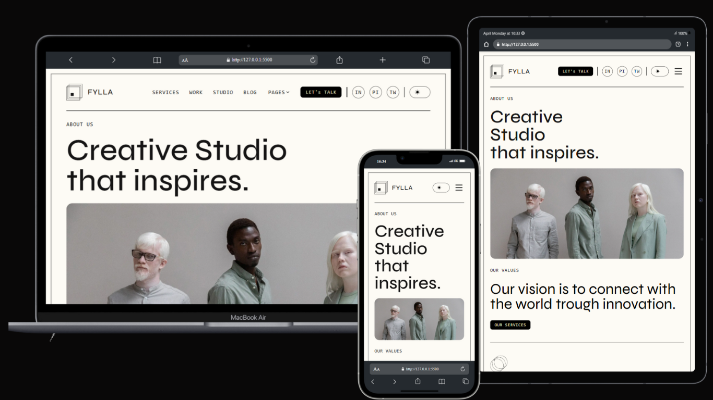

# Fylla - Responsive UI Showcase ✨

Fylla is a static, non-interactive website built to demonstrate modern UI design and responsive layout skills using **HTML**, **SCSS**, and **Media Queries**.  
This project reflects my eye for design, layout structuring, and mobile-first development approach.

---

## 🚀 Features

- ⚡ Pixel-perfect responsive design
- 🎨 Modern and aesthetic UI elements
- 🧱 Built using semantic HTML5
- 💅 SCSS-powered modular styling
- 📱 Fully responsive across all devices

---

## 🛠️ Technologies Used

- HTML5
- SCSS (Sassy CSS)
- CSS Media Queries

---

## 📸 Screenshots

| | Output |
|--------------|-------------|
|  |

*(Add actual screenshots if available)*

---

## 🧑‍💻 Author

**[Keshav Kumar]**  
Passionate front-end developer with a love for clean design and responsive web development.

---

## 📂 Folder Structure

